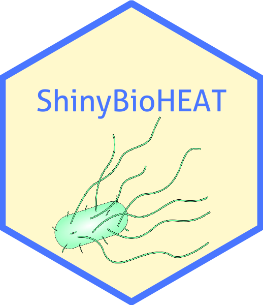

<!-- README.md is generated from README.Rmd. Please edit that file -->

```{r, include = FALSE}
knitr::opts_chunk$set(
  collapse = TRUE,
  comment = "#>",
  fig.path = "man/figures/README-",
  out.width = "100%"
)
```

# ShinyBioHEAT 

<!-- badges: start -->
[](https://lifecycle.r-lib.org/articles/stages.html#experimental)
<!-- badges: end -->

The goal of ShinyBioHEAT is to provide a shiny interface to allow users to predict phenotype driver gene in lab evolved *E. coli* strains using Evolutionary Action.

## Installation

You can install the development version of ShinyBioHEAT like so:

```{r, eval=FALSE}
devtools::install_github("LichtargeLab/ShinyBioHEAT")
```

## To load the shiny app

```{r, eval=FALSE}
library(ShinyBioHEAT)
run_app()
```

