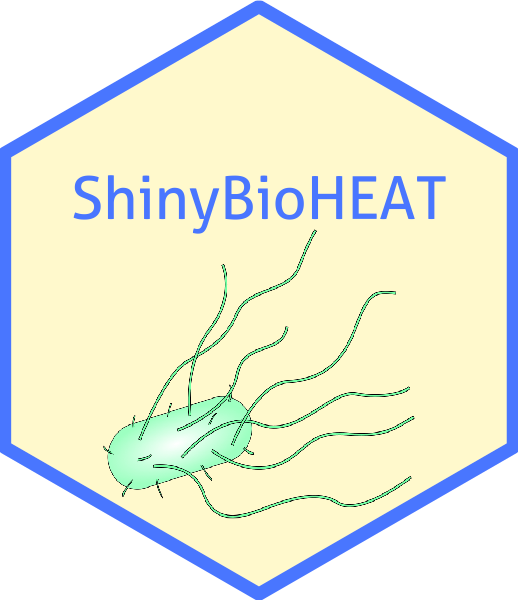

<!-- README.md is generated from README.Rmd. Please edit that file -->

# ShinyBioHEAT 

<!-- badges: start -->

[](https://lifecycle.r-lib.org/articles/stages.html#experimental)
<!-- badges: end -->

The goal of ShinyBioHEAT is to provide a shiny interface to allow users
to predict phenotype driver gene in lab evolved *E. coli* and *B.
subtilis* using Evolutionary Action. It currently supports 3 reference
genomes including: *E. coli* MG1655, *E.coli* REL606 and *B. subtilis*
168. A live version of the application is hosted at
<http://bioheat.lichtargelab.org>. The application contains 3 modules:

1.  **Driver Gene Analysis**: Two orthogonal approaches, EA integration
    and Frequency based method, are used to identify phenotype driven
    genes.
2.  **Quick EA search**: EA (Evolutionary Action) scores predicts the
    functional impact of protein coding mutations
    ([ref](https://genome.cshlp.org/content/24/12/2050.long)). This
    module allows user to quickly search the EA score of any given
    mutations in the selected reference genome.
3.  **Structure Viewer**: Mapping mutation data and EA/ET scores to
    AlphaFold structures.

## Installation

You can install the development version of ShinyBioHEAT like so:

``` r
devtools::install_github("LichtargeLab/ShinyBioHEAT")
```

## To load the shiny app

``` r
library(ShinyBioHEAT)
run_app()
```

## Related References

[Marciano DC, Wang C, Hsu TK, Bourquard T, Atri B, Nehring RB, Abel NS,
Bowling EA, Chen TJ, Lurie PD, Katsonis P, Rosenberg SM, Herman C,
Lichtarge O. Evolutionary action of mutations reveals antimicrobial
resistance genes in Escherichia coli. Nat Commun. 2022 Jun
9;13(1):3189.](https://www.nature.com/articles/s41467-022-30889-1)

[Katsonis P, Lichtarge O. A formal perturbation equation between
genotype and phenotype determines the Evolutionary Action of
protein-coding variations on fitness. Genome Res. 2014
Dec;24(12):2050-8.](https://genome.cshlp.org/content/24/12/2050.long)
